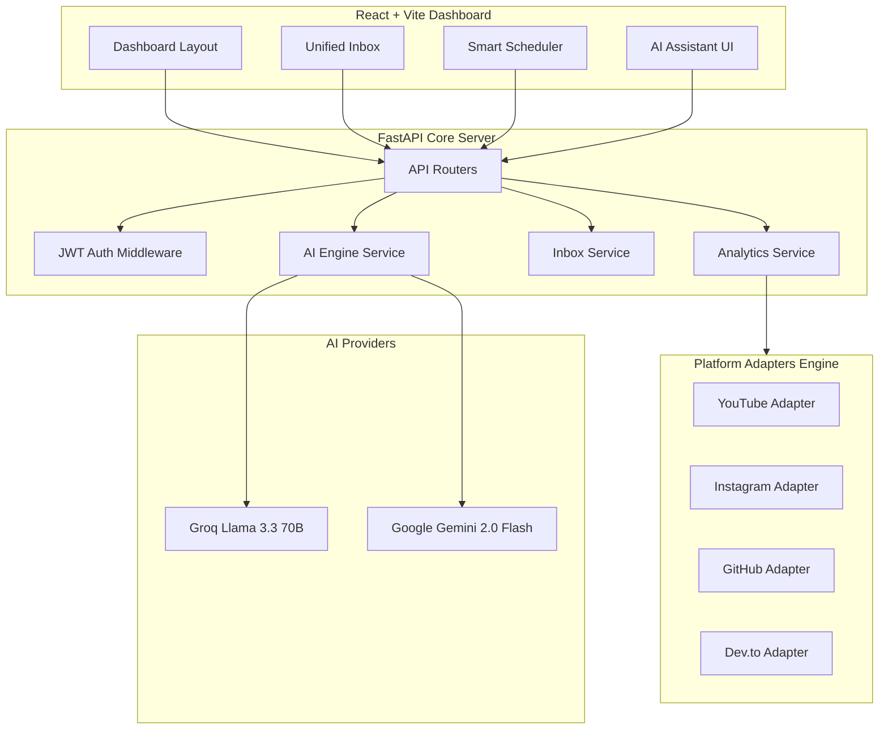

# OmniSocial AI 🚀

A modern, high-performance creator analytics & multi-platform management dashboard powered by FastAPI, React, and LLM-driven audience intelligence.

OmniSocial AI provides creators, influencers, and developers with a single control center to track cross-platform follower growth, analyze engagement trends, manage a unified comment inbox, schedule upcoming content, and consult an AI assistant grounded in real profile metrics.

---

## 🌟 Key Features

- **📊 Unified Multi-Platform Analytics**
  - Live API integration for **YouTube**, **Instagram**, and **GitHub**.
  - Real-time subscriber counts, video views, repository stars, engagement rates, and monthly revenue estimates.
  - Interactive performance charts and 30-day growth trendlines.

- **🤖 Context-Aware AI Creator Assistant**
  - Powered by **Groq Llama 3.3 70B** with fallback support for **Google Gemini**.
  - Grounded directly on your live cross-platform metrics — ask questions about your follower growth, revenue trends, or posting strategies and get instant data-driven answers.

- **📬 Unified Interactions Inbox**
  - Single aggregated feed for comments and discussions across YouTube, GitHub, Instagram, and more.
  - Filter by platform or unread status, view commenter profiles, and send instant inline replies.

- **📅 Smart Post Scheduler & Best-Time Engine**
  - Visual calendar and queue planner for scheduling cross-platform posts.
  - AI best-time recommendations based on peak audience engagement slots.

- **⚡ Extensible Adapter Architecture**
  - Pluggable platform engine (`PlatformAdapter`) with automatic failover and rate-limit resilience.
  - Built-in placeholder support for upcoming platforms (LinkedIn, TikTok, Facebook, X, Reddit).

---

## 🛠️ Technology Stack

### Frontend
- **Framework**: React 18 + Vite
- **Styling**: Vanilla CSS Design Tokens (Custom dark mode, glassmorphism, fluid responsive layouts)
- **Icons**: Lucide React + React Icons (`fa6`, `si`)
- **HTTP Client**: Axios

### Backend
- **Framework**: FastAPI (Async Python 3.11+)
- **Database / ORM**: SQLite + SQLAlchemy ORM
- **AI Engines**: Groq API (`llama-3.3-70b-versatile`) + Google Gemini REST API
- **HTTP Client**: HTTPX (Async HTTP requests)
- **Authentication**: JWT (JSON Web Tokens) + Passlib / Bcrypt

---

## 🏗️ System Architecture



---

## 🚀 Quick Start

### 1. Repository Setup
```bash
git clone https://github.com/abhishekraj185a-wq/OmniSocial-AI.git
cd OmniSocial-AI
```

### 2. Backend Setup (`omnisocial-backend (1)`)
```bash
cd "omnisocial-backend (1)"

# Create virtual environment
python -m venv venv
# On Windows:
venv\Scripts\activate
# On Linux/macOS:
# source venv/bin/activate

# Install dependencies
pip install -r requirements.txt

# Create environment file
cp .env.example .env

# Run FastAPI backend server
uvicorn app.main:app --reload
```
> The API server will start on `http://localhost:8000` (Swagger docs available at `http://localhost:8000/docs`).

### 3. Frontend Setup (`omnisocial-frontend (1)`)
Open a new terminal window:
```bash
cd "omnisocial-frontend (1)"

# Install dependencies
npm install

# Run Vite development server
npm run dev
```
> Open your browser at `http://localhost:5173`.

---

## 🔐 Environment Configuration (`.env`)

Create a `.env` file inside `omnisocial-backend (1)`:

```env
# AI Assistant Key (Free key from groq.com)
GROQ_API_KEY=gsk_...

# YouTube Data API Key (Optional for live YouTube channel stats)
YOUTUBE_API_KEY=AIzaSy...

# Database & Security
DATABASE_URL=sqlite:///./omnisocial.db
JWT_SECRET=your-secret-jwt-key
CORS_ORIGINS=http://localhost:5173
```

---

## 📂 Project Structure

```
OmniSocial-AI/
├── omnisocial-backend (1)/       # FastAPI Application
│   ├── app/
│   │   ├── core/                  # Database, Config, Security & JWT
│   │   ├── models/                # SQLAlchemy ORM Models (User, Chat, Posts)
│   │   ├── repository/            # DB Query Layers
│   │   ├── routers/               # FastAPI Endpoints (/auth, /analytics, /chat, /inbox, /scheduler)
│   │   ├── services/              # Business Logic & AI Services
│   │   │   └── platforms/         # Extensible Platform Adapter Engine
│   │   └── main.py                # App Initialization & Middleware
│   ├── requirements.txt
│   └── .env.example
│
└── omnisocial-frontend (1)/      # React + Vite Application
    ├── src/
    │   ├── api/                   # Axios API Clients
    │   ├── components/            # Reusable UI Components & Charts
    │   ├── context/               # Auth State Context Provider
    │   ├── layouts/               # Dashboard Layout & Sidebar
    │   ├── pages/                 # Overview, Platforms, Inbox, Scheduler, AI Chat
    │   └── index.css              # Core Design Token Tokens & Utilities
    ├── package.json
    └── vite.config.js
```

---

## 🤝 Contributing

Contributions, issues, and feature requests are welcome! Feel free to check the issues page.

---

## 📜 License

Distributed under the MIT License. See `LICENSE` for more information.
